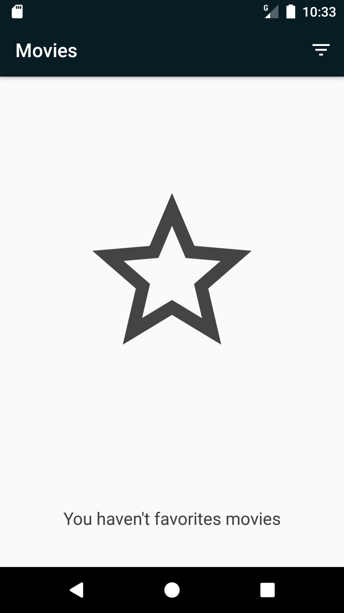
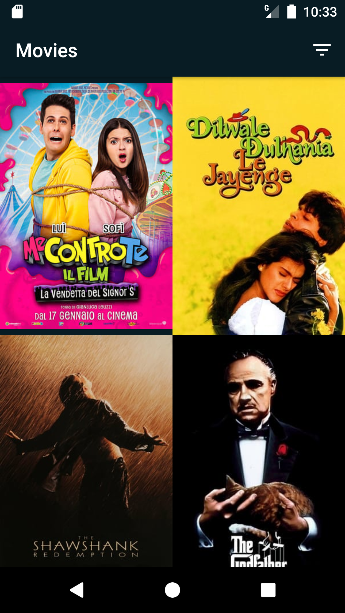
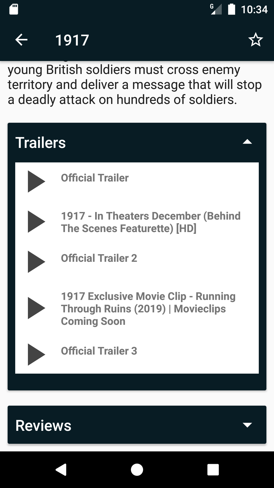

# Popular Movies, Stage 2

## Project Overview
This project shows a list of movies, which can be filtered by popular or top rated or favorites-

## Why this Project

It is an exercise for Udacity's "Android Developer Nanodegree Program".

## API KEY

If you want to test the exercise, you have to register in themoviedb.org and replace you API KEY in:

**config.properties**

## IMAGES

